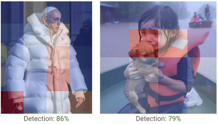
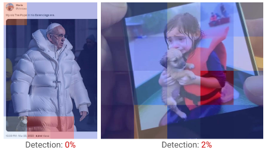
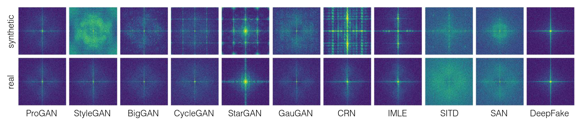

## Introduction

It is almost impossible now to go on any social media and not see at least one generated image or even a video. With the rise of generative models such as DALL-E, Stable Diffusion, and Midjourney, the quality of these images has improved drastically. While this is an exciting advancement in AI, it also raises concerns about misuse of such technology, especially in the context of misinformation and deepfakes.

As Uncle Ben once said:

And now, that power lies in the hands of many. Fortunately, in these times, these models are mostly used for _brainrot_ memes and art generation, which are harmless by themselves, but there has been a rise in fraudulent activities using these models. From generating fake profiles on social media to creating misleading images for political propaganda, the potential for harm is significant.

This is why it is important to address these issues, and to bring attention to them. By collectively working on prevention mechanisms, and tools for oversight of these generative models, we can help make internet a safer place. One such mechanism is the **detection of synthetic images**. By developing frameworks, methods and models that can accurately identify generated images, we can mitigate the risks associated with their misuse. And yes, you heard me right, "use _models_ to fight against models themselves", quite ironic.

Now, if you clicked to read more about this project, I can assume you're interested in it and want to know more about the techniques for detecting generated images. I assure you that you came to the right place, sort of. In the following paragraphs, I'll be writing about my findings of the field called _"Synthetic Image Detection (SID)"_ which I encountered while doing the research at CTU Prague, for my master's thesis (_which I strongly recommend you to read, link will be at the end [1]_). Main focus will be on the interesting discoveries I found, without too much in-depth theory and math. I want to introduce the field of _SID_ to the people and to bring attention to its usefulness, and I also want it to be simple enough for everyone to understand and to be able to learn something new from it, while it also encourages practical and intuitive thinking without pure theory and math. 

With that said, I do encourage you to discuss your opinions and thoughts in the comment section below. The field itself is still new, and I can't pretend like I'm 100% correct with every single fact, so feel free to comment if you disagree with anything. Also, by the time I publish this article, there might be some new discoveries in the field, so if you know about any new methods or techniques, please share them in the comments as well.

## How do generative models work?

Before delving into main topics, it would be smart to _understand our opponent_, or in our case, to understand how generative models work. There are many types of generative models, ranging from **GANs** (Generative Adversarial Networks) to **VAEs** (Variational Autoencoders) and **Diffusion Models**. Each of these models has its own architecture and way of generating images, but they all share a common idea: _Look at the bunch of data, learn the patterns, and generate new data that resembles the original distribution_.

Let's say you are a generative model, and you want to learn how to generate images of cats, but you don't know what a cat looks like. So, you are given a dataset of cat images, and you start analyzing them. You look at the shapes, colors, textures, and all the patterns that make a cat. After analyzing enough images, you start to understand that furry texture is common, that cats have pointy ears, and that they often have a certain shape of eyes.

 

") 

Now, for you that doesn't sound too hard, right? You just look at the images, and you learn the patterns. What you're doing implicitly is that you're learning the distribution of the data. You learn that among all possible images, the ones that look like cats have certain characteristics, and you learn to generate new images that have those characteristics. In a way, you learn to "pick" the right characteristics to generate a new image.

For a machine, it's not that simple. The machine doesn't have eyes to see the images, it has to process them as numbers. So, it takes the pixel values of the images and feeds them into a neural network. The neural network then learns to recognize the patterns in the data and generates each pixel of the new image based on those patterns. It learns the distribution of the data, and generating new images is essentially sampling from that distribution. For some simpler datasets, like MNIST, which consists of images that are 28x28 pixels, that's shouldn't be too hard, but for more complex datasets, like ImageNet, which consists of images that are 224x224 pixels, it becomes much more challenging. The model has to learn a much more complex distribution, and it has to generate a much larger number of pixels.

To tackle this problem, researchers have developed various architectures and techniques, some based on the mathematical foundations of probability and statistics, some based on the principles of physics, and some just based on the intuitive understanding of the problem. Mostly, those techniques are based on the idea that, instead of learning the distribution of the data directly, we can learn to generate images by learning to transform a simple distribution (like a Gaussian distribution) into the complex distribution of the data. For example, each of the architectures I mentioned earlier (GANs, VAEs, Diffusion Models) has its own way of doing this transformation. GANs use a generator and a discriminator to learn this transformation, VAEs use an encoder and a decoder, and Diffusion Models use a process of adding noise to the data and then learning to reverse that process.

That said, the field of generative models is vast and complex, and there are many architectures and techniques that have been developed. The ones I mentioned are just a few examples, and there are many more out there. There's a lot of mathematics and theory behind these models, but I won't go into that in this article. If you're interested in learning more about the theory and mathematics behind generative models, I recommend you to check out some resources I will link at the end of this article, and my master's thesis, as well. :)

## Synthetic Image Detection - or just "Detection of generated images"

I'll first start by saying that this name is just a fancy and smart way to say "Detection of generated images". With the name of _SID_, you enclose a large group of methods that can be used for the task of detecting generated images, explaining the features of the images that can be used for detection, and also explaining the techniques that can be used to extract those features. The field of _SID_ is still new, at least it was new when I started working on it, and there are still many open questions and challenges that need to be addressed.

While just defining the task of _SID_ as "Detection of generated images" is technically correct, it doesn't capture the full scope of the field. _SID_ is not just about detecting generated images, it's also about understanding the characteristics of those images, and developing techniques to extract those characteristics, while also addressing fundamental challenges of the field:

- **Model-agnostic generalization**: The field of _SID_ is not just about detecting images generated by a specific model, it's about developing techniques that can generalize to images generated by any model. This is a significant challenge, because different models can generate images with different characteristics, and the techniques that work for one model might not work for another.
- **Robustness to image perturbations**: Another challenge in _SID_ is ensuring that the detection methods are robust to various image perturbations, such as noise, compression, and other transformations that might be applied to the images. This is, of course, important because images on the internet often appear in the form of a derivative of the original image, or greatly compressed, edited, or even just a screenshot of the original image. Interestingly, in the paper ["Any-Resolution AI-Generated Image Detection by Spectral Learning"\*](http://arxiv.org/abs/2411.19417), the authors noticed that even their method that had performed extremely well on the datasets commonly used for _SID_ research, had a significant drop in performance when parts of synthetic images appeared in screenshots, memes, or even in the photographs of computer screens.

     

- **Localized detection**: While being able to detect whether image is real or generated is our main goal, it's common that only parts of the image are generated, such as in the case of deepfakes. So, enabling fine-grained detection can cover those types of images as well, while providing more insights for better understanding the characteristics of generated images.
- **Data-agnostic detection**: Most of the methods for _SID_ are trained using both real and generated images, which means that not only do they rely on the existence of dataset of generated images, but they can also be biased towards the specific dataset they were trained on. That's why the focus should be on developing methods that can detect generated images without relying on specific datasets, and that can generalize to images generated by any model, even those that haven't been seen during training. 

Okay, so that is what defines the field of _SID_, but the detection methods themselves still can differ greatly.

### What do the methods for _SID_ have in common?

While I was gathering materials and reading through papers to summarize the field of _SID_, I noticed that most of the ideas and methods for tackling the challenges posed by the field follow similar architecture, but they mostly differ on these two parts:

- **Feature extraction**
- **Training paradigm**

Feature extraction is a common word that is passed along when talking about any form of deep learning, it is an essential part of the process in which we extract specific characteristics from data that can help us in our goals.

When it comes to the _SID_, features extracted from images are based on the assumptions about the generators, i.e., that the images they create share some signs that tell them apart from real one. It is as if you're trying to tell an original Picasso from a fake one; there are some "ways" in which Picasso specifically drew that can't be copied by any other artist.

In case of generative models, these features can be separated into these categories based on the abstraction:

- **Low-level artifacts**:
    - Pixel-level statistical anomalies that result from the limitations of generative models in reproducing the fine-grained details and correlations found in real images.
    - _Heightened local correlations, spectral distortions, boundary inconsistencies..._

    

- **Mid-level artifacts**:
    - Inconsistencies in texture patterns and local spatial correlations.
    - **Texture patterns, spatial correlations, color distributions...**
- **High-level artifacts**:
    - Semantic or conceptual inconsistencies that emerge from generative models’ failure to fully capture complex visual relationships and world knowledge.
    - _Semantic inconsistencies, contextual anomalies, textual artifacts..._
    - These are not as common anymore since the models got really better at fixing these issues.

      

Of course, this categorization has a deeper semantic meaning to us humans, as we can even maybe describe these features with some mathematical functions of sort that logically represents our understanding of it - But what about the features from some pre-trained model, you know, like the models already trained on a large amount of images, on some other tasks beside the SID? Well, if you thought about that, well thought.

**Foundation model features**

While the models from which we take these features are trained on other, non-SID task job, the research has shown that they can also be utilized, especially with the rise of _Foundation models_ - A group of deep learning models trained on tasks that push the models to "understand" various semantic and contextual concepts.   

## References

\[1] D. Babić, "Detection of maliciously crafted content" 2025. [[Online]](https://repozitorij.fer.unizg.hr/object/fer:13496)

\[2] D. Karageorgiou, S. Papadopoulos, I. Kompatsiaris, and E. Gavves, “Any-resolution ai-generated image detection by spectral learning,” 2025. [[Online]](https://arxiv.org/abs/2103.00020)

\[3]  S.-Y. Wang, O. Wang, R. Zhang, A. Owens, and A. A. Efros, “Cnn-generated images are surprisingly easy to spot... for now,” 2020. [[Online]](https://arxiv.org/abs/1912.11035)
